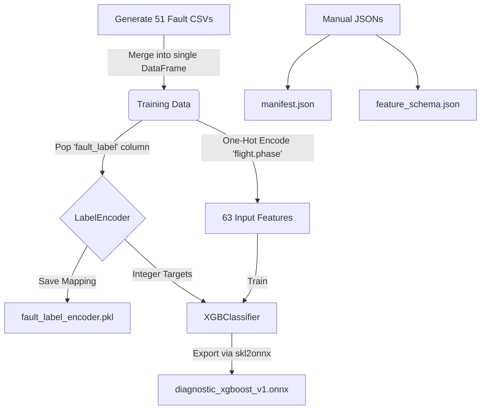

# SPASHT AI: Diagnostic Model Training Guide

This guide contains everything you need to know to train the Diagnostic XGBoost model, build the artifacts, and integrate it with your Python runtime.

## 1. The Diagnostic Architecture Graph

---

## 2. Which Files You Need to Make
You need to generate **51 separate CSV files** (totalling ~459,000 rows). 
Each file should have **58 columns**: `flight.phase`, the 53 physical parameters, the 3 `anomaly_scores` (thermal, mechanical, electrical), and the `fault_label` string.

*   `flight_001_nominal.csv` to `flight_015_nominal.csv` (15 files)
*   `flight_016_minor_overheat.csv` to `flight_017...` (2 files per specific fault, covering all 18 fault types in the Sanjeevani matrix).

---

## 3. How to Train the Model
1.  **Load the Data:** Use Pandas to read all 51 CSV files and concatenate them into one massive table.
2.  **Encode the Target:** Extract the `fault_label` column (which contains strings like `"COOLANT_SYSTEM_LEAK"`). Machine learning models only understand numbers, so you must convert these strings to integers (e.g., 0, 1, 2) using `sklearn.preprocessing.LabelEncoder`.
3.  **One-Hot Encode Phase:** The `flight.phase` column contains strings (e.g., `"STARTUP"`). You must convert this into 7 binary columns (0s and 1s) using `pd.get_dummies()`. This expands your input features from 56 to 63.
4.  **Train:** Pass the 63 features and the integer targets into `xgboost.XGBClassifier(tree_method='hist')`.

---

## 4. How to Make `.pkl` (Pickle Files)
A `.pkl` file is just a saved Python object. 
*   **Why you need it:** Your Python backend needs to know that the number `4` output by the XGBoost model actually means `"COOLANT_SYSTEM_LEAK"`.
*   **How to make it:** After you use `LabelEncoder` to transform your targets during training, you literally just save that encoder object using the `joblib` library:
    `joblib.dump(label_encoder, 'fault_label_encoder.pkl')`

---

## 5. How to Make `.onnx` (Model Export)
ONNX is a universal format that allows the Python runtime to execute the model incredibly fast without needing the massive XGBoost training library installed.
*   **How to make it:** After `model.fit()` finishes, use the `skl2onnx` Python library. You tell it to expect an input of 63 floats (`FloatTensorType([None, 63])`), and it will serialize your trained XGBoost model into a binary file named `diagnostic_xgboost_v1.onnx`.

---

## 6. How to Make `manifest.json` and `feature_schema.json`
You do **not** use code to generate these. You just open Notepad (or VS Code) and type them out manually, then save them in the backend folder.
*   **`manifest.json`:** A simple 5-line text file telling the runtime the model's name (`"SPASHT-Diagnostic"`), version (`"1.0"`), and framework (`"ONNX"`).
*   **`feature_schema.json`:** A simple text array `["param1", "param2", ...]` listing the exact 63 columns the model expects, in the exact order it expects them. The Python backend reads this text file so it knows how to slice the live telemetry stream.
