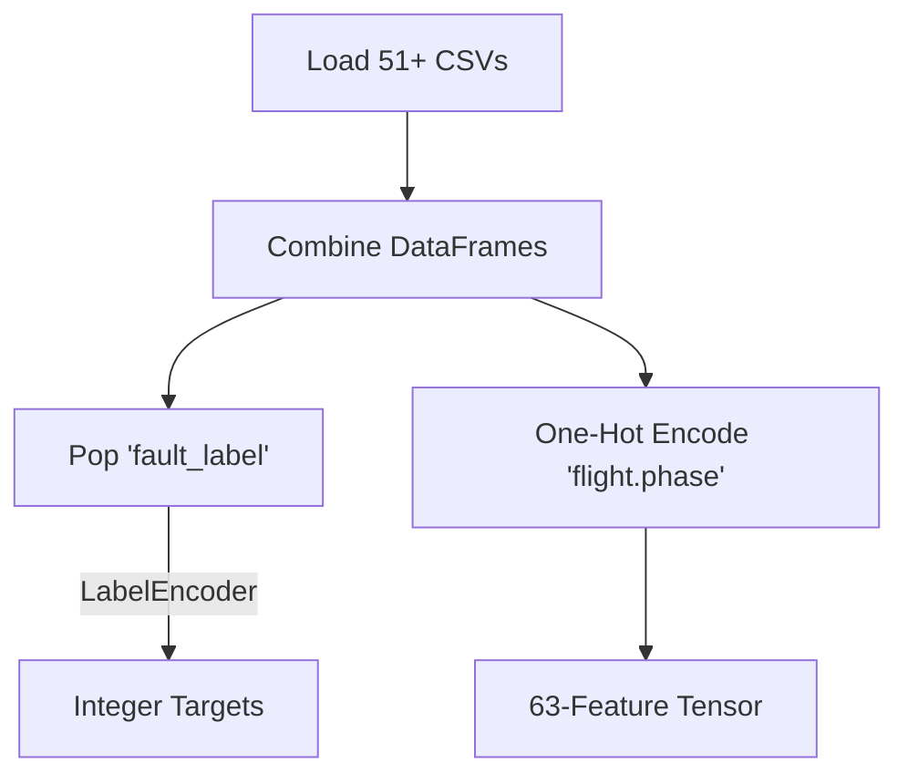

# Diagnostic Training: Step 1 - Data Preparation



This is the first step for training the XGBoost Diagnostic Model. Your AI team must follow this data pipeline exactly to ensure the 63-feature tensor is formed perfectly.

### 1. Load All Generated CSVs
You will have dozens of CSV files (51+ base faults, plus all the cascading and total failure datasets you are currently generating). 
The first step is to read all of these CSVs and concatenate them into a single massive Pandas DataFrame.
```python
import pandas as pd
import glob

# Load all generated fault and nominal CSV files
all_files = glob.glob("diagnostic_dataset/*.csv")
df_list = [pd.read_csv(f) for f in all_files]
df = pd.concat(df_list, ignore_index=True)
print(f"Total rows loaded: {len(df)}")
```

### 2. Extract and Encode the Target Label
Machine learning models cannot understand strings like `"COOLANT_SYSTEM_LEAK"`. We must convert the `fault_label` column into integers (0, 1, 2, ...).
```python
from sklearn.preprocessing import LabelEncoder
import joblib

# Pop the target column out of the training features
y_strings = df.pop('fault_label')

# Convert strings to integers
le = LabelEncoder()
y = le.fit_transform(y_strings)

# CRITICAL: Save this encoder for Step 3!
joblib.dump(le, 'fault_label_encoder.pkl')
```

### 3. One-Hot Encode the Flight Phase
The `flight.phase` column contains strings (e.g., `"CRUISE"`). XGBoost needs this to be binary. We will use `pd.get_dummies` to expand this single column into 7 binary columns.
```python
phases = ["STARTUP", "WARMUP", "TAKEOFF", "CLIMB", "CRUISE", "DESCENT", "LANDING"]
df['flight.phase'] = pd.Categorical(df['flight.phase'], categories=phases)

# One-Hot Encode
X = pd.get_dummies(df, columns=['flight.phase'])

print(f"Final Input Tensor Shape: {X.shape[1]} (Must be exactly 63)")
```

### Next Step
Once you have `X` (63 columns) and `y` (integer targets), proceed to **Step 2: XGBoost Training**.
