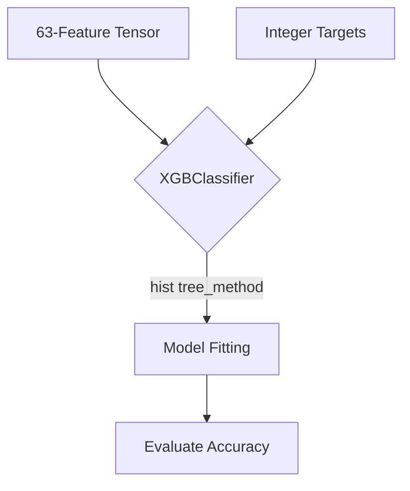

# Diagnostic Training: Step 2 - XGBoost Training



Once you have prepared `X` (63 columns) and `y` (integer targets) from Step 1, you are ready to train the model.

### 1. Initialize XGBoost
Because you are dealing with almost half a million rows of data, standard training algorithms will take hours. You must use XGBoost's **histogram-based tree method**. It buckets continuous features into discrete bins, making it incredibly fast.
If you are running this on Google Colab, set `device='cuda'` to utilize the free GPU.

```python
from xgboost import XGBClassifier

# Initialize the model with performance hyperparameters
model = XGBClassifier(
    n_estimators=300,        # Number of trees (boosting rounds)
    max_depth=6,             # Maximum depth of each tree
    learning_rate=0.1,       # Step size shrinkage
    tree_method='hist',      # CRITICAL: Histogram-based algorithm for massive datasets
    device='cuda'            # CRITICAL: Uses GPU acceleration (if on Colab)
)
```

### 2. Train the Model
This step will begin the boosting process. It will learn how the 53 physical parameters, the 3 anomaly scores, and the 7 phase flags relate to each of the 19 possible fault classes.
```python
print("Training Diagnostic Engine. This may take a few minutes...")
model.fit(X, y)
print("Training Complete!")
```

### 3. Evaluate (Optional but Recommended)
Before exporting, it's wise to check the model's accuracy on the training data just to ensure the trees converged properly.
```python
from sklearn.metrics import classification_report

predictions = model.predict(X)
print(classification_report(y, predictions))
```

### Next Step
Once training is complete and accuracy looks good (>95%), proceed to **Step 3: ONNX Export**.
