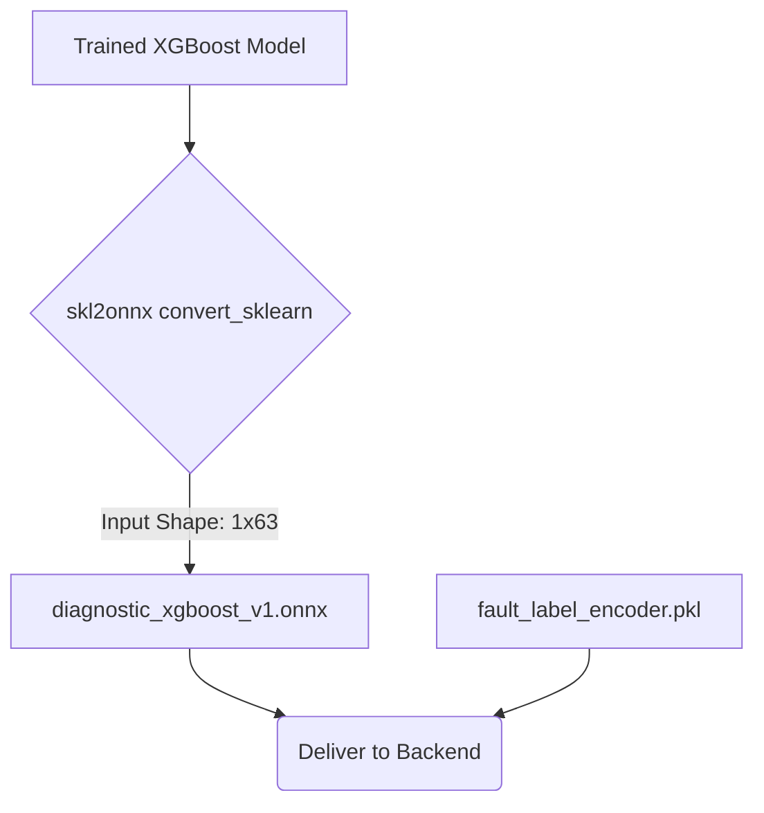

# Diagnostic Training: Step 3 - ONNX Export



Now that your XGBoost model is trained, you cannot simply save it as a standard `.json` or `.pkl` file. Your SPASHT Python Runtime Architecture specifically demands an **ONNX** format for blazing-fast inference without needing XGBoost installed on the backend.

### 1. Install ONNX Conversion Tools
In your Colab notebook, ensure you have the conversion tools installed:
```bash
!pip install onnx onnxruntime skl2onnx
```

### 2. Convert to ONNX
You must explicitly tell the ONNX converter the exact shape and data type of the tensor it will receive in production. Since we one-hot encoded the phase, the input tensor is precisely **63 floats**.

```python
from skl2onnx import convert_sklearn
from skl2onnx.common.data_types import FloatTensorType

# Define the exact input signature required by the SPASHT Runtime
# [None, 63] means it can accept any batch size, but must have exactly 63 columns.
initial_type = [('float_input', FloatTensorType([None, 63]))]

print("Exporting Diagnostic XGBoost to ONNX...")
onnx_model = convert_sklearn(model, initial_types=initial_type, target_opset=12)
```

### 3. Save the File
Write the serialized ONNX string to a binary `.onnx` file.
```python
with open("diagnostic_xgboost_v1.onnx", "wb") as f:
    f.write(onnx_model.SerializeToString())

print("Successfully generated diagnostic_xgboost_v1.onnx!")
```

### 4. Final Delivery to the Backend Team
You now have the two critical artifacts required by the Runtime Layer. Download these from Colab and give them to your backend engineers:
1. `diagnostic_xgboost_v1.onnx` (The neural network graph from this file)
2. `fault_label_encoder.pkl` (The string-to-integer mapping from Step 1)

They will place these next to the `manifest.json` and `feature_schema.json` files, completing the Diagnostic Model integration!
